# Build Multi Region & High Resilient Modern Data Architecture using AWS Glue and AWS Lake Formation Services

This project shows a way to build a highly available design that automates the Amazon S3, AWS Glue data catalog and AWS Lake Formation permission backup into a different region. The solution provides a backup and restore option for use in case of disaster recovery situations. The solution is customizable to an organization’s internal process. 

## Prerequisites
- Install [AWS CLI](https://aws.amazon.com/cli/).
- Install [AWS CDK](https://aws.amazon.com/cdk/).
- Install [Python](https://www.python.org/downloads/).
- An AWS account for use with deployment and testing.
- Updated [configuration file](./glue_config.conf) with options to customize Lake Formation restore from a source region to a target region. See this [`description`](#configuration-options) for deatils about the configuration options. Once you upload your configuration file to an S3 bucket, make note of the configuration S3 bucket name and the backup file bucket name specified in the configuration file. 

## Deployment
- [Configure AWS CLI in your source region](https://docs.aws.amazon.com/cli/latest/userguide/cli-chap-configure.html).
- [Bootstrap AWS CDK in your source region](https://docs.aws.amazon.com/cdk/v2/guide/bootstrapping.html).
- From the command line, clone this repository using "git clone url" where "url" can be found when you click the "Clone" button on this repository.
- Change directory to the newly cloned project.
- Create a Python virtual environment using the following command:
```
python -m venv venv
```
- Activate the newly created environment:
```
On Windows, run
.\venv\Scripts\activate.bat
On Unix or MacOS, run
source ./venv/bin/activate
```
- Install the required dependencies using the following command:
```
pip install -r requirements.txt
```
- Use CDK to deploy the infrastructure and the Glue Python script using the following command:
```
cdk deploy --context config_bucket_name="ctldl" --context backup_bucket_name="s3use1src" --context target_region="us-west-2" --all
```
Replace the config_bucket_name, backup_bucket_name, and the target_region with your settings specified in the configuration file. 
- After you deployment is successful, confirm you can see the newly deployed job in your source region Glue Jobs list. The newly created Glue job role will also be added as a Data Lake administrator in the target region. Two screenshots are shared below for reference.
    1. Newly deployed Python shell job in the source region:
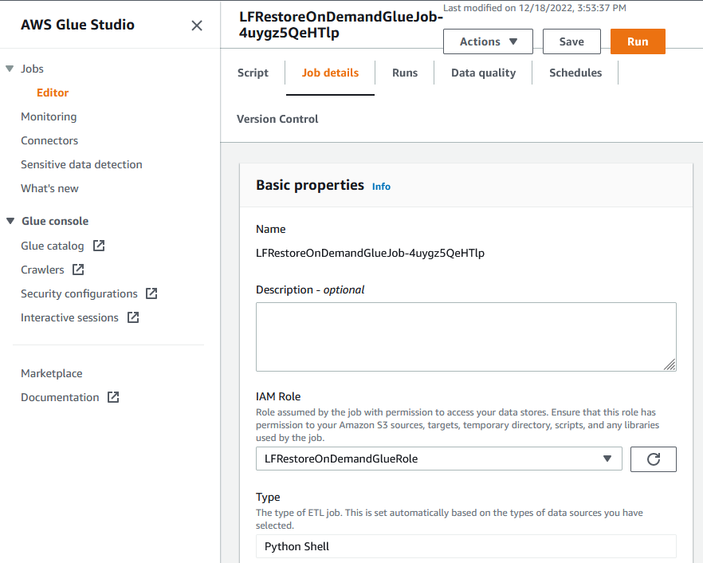
    2. Glue role is added as admin on the target region: 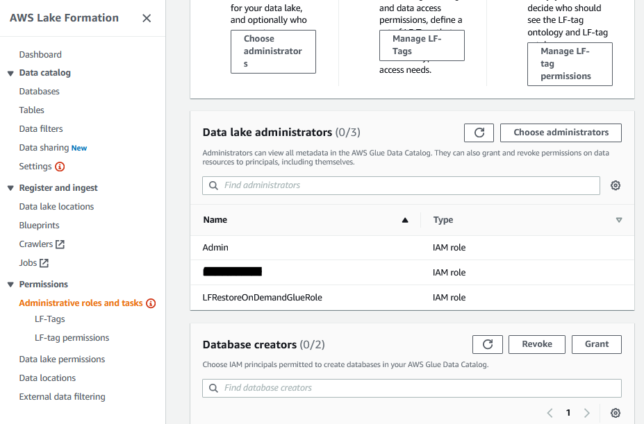


## Testing
### Current State in Source Region Lake Formation
Databases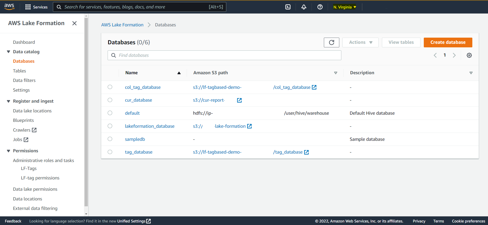
Tables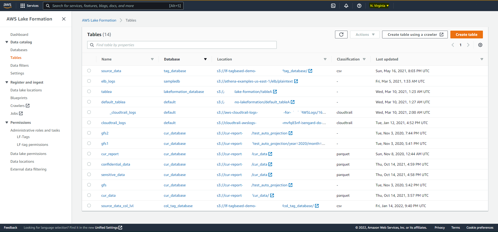
Data Permissions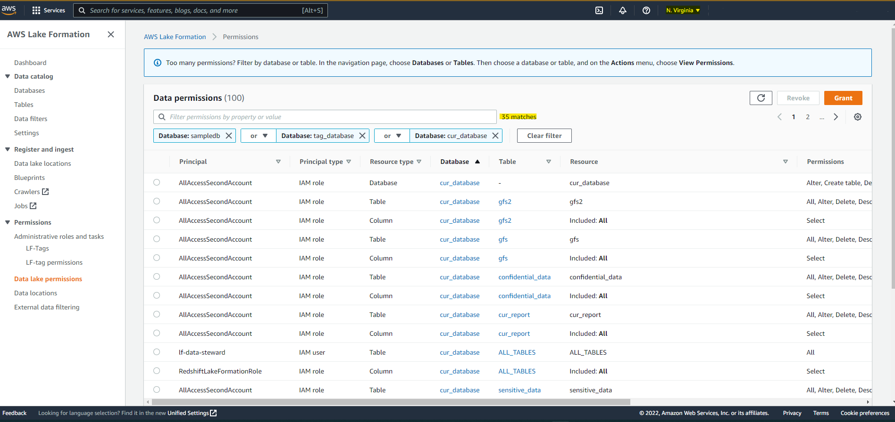
Data Permissions (Continued)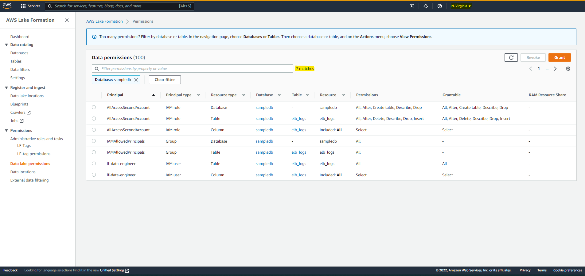

### Run Restore Job
- A configuration is used to replicate 3 databases ("sampledb", "tag_database", "cur_database"), all tables, and all data permissions on the three databases and the associated tables.
- The source region is set as "N.Virginia" and the target region for replication is set as "Mumbai".
- In the source region, run the Glue job from the AWS Glue Studio using the "Run" button as shown below:
- Confirm the Glue job ran successfully as shown below: 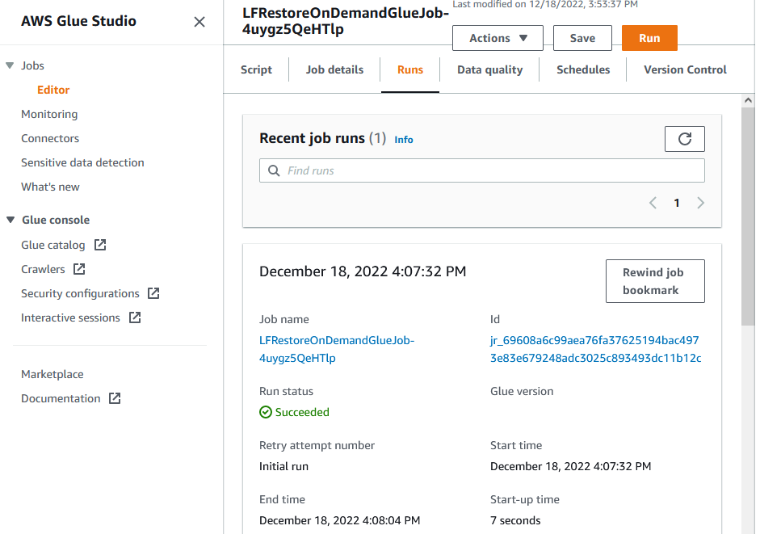

### Results in Target Region Lake Formation
Databases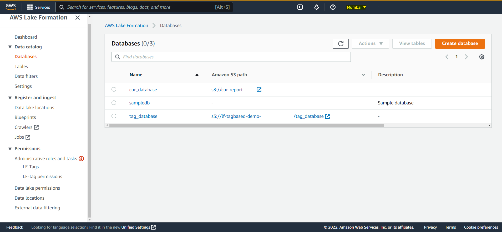
Tables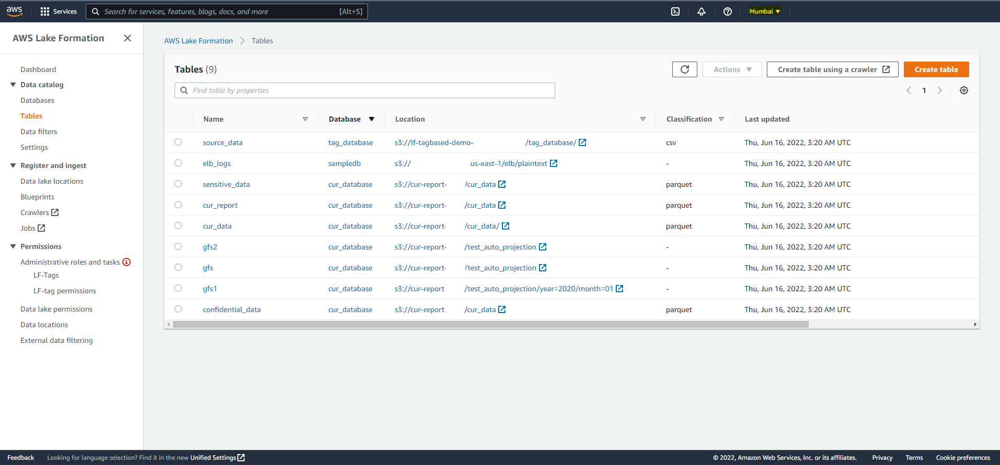
Data Permissions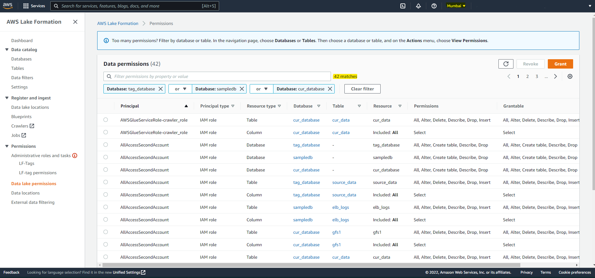
Data Permissions (Continued)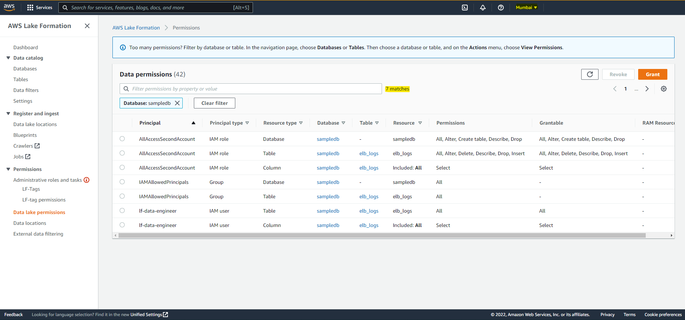

## Configuration Options
1.	Default: This contains default values used for replication. If you are planning to replicate to a AWS region which is not part of the default list, please add it before executing the utility.
2.	Operation: The replication job performs two operations, namely, synchronize Glue Catalog and Lake Formation permissions. Any application of the Lake Formation permission requires presence of underlying Glue catalog objects. This can be externally ensured or can be enabled or disabled through this configuration. This section has the below options:
    1.	sync_glue_catalog: If the value of the parameter is set to “True” the glue catalog will be synchronized between the source and destination regions. If it is set to “False” the glue catalog will not be synchronized.
    2.	delete_target_catalog_objects: If a glue catalog object is deleted from the source region this parameter gives us the option to delete the same object from the target region keeping the source and target region synchronized. This can be achieved by setting the value of this parameter to “True”. If the value is set to “False” any glue catalog object deleted from the source region will not be deleted from the target region during the synchronization.
    3.	sync_lf_permissions: If the value of the parameter is set to “True” the lake formation permissions will be synchronized between the source and destination regions. To synchronize the lake formation permissions the underlying glue catalog objects should already have been synchronized. If it is set to “False” the lake formation permissions will not be synchronized.
3.	Target_s3_update: The underlying storage for an Athena table can reside in any region. While replicating the metadata for a table, one can choose to keep the original S3 location or can provide an alternative S3 location within the same region or within a different region (e.g. region local). By setting the parameter "update_table_s3_location" to "True", the S3 bucket for an Athena table can be mapped to a different S3 Bucket. The value of the new S3 bucket can be provided by using the parameter "target_s3_locations". If the S3 bucket name provided using the parameter "target_s3_locations" exists, then the Athena table is mapped to this location. If the S3 bucket prefix does not exist then the original S3 bucket location is retained. Please note, while using this parameter only the S3 bucket name is updated, and the rest of the prefix hierarchy is retained.
4.	ListCatalog: The ListCatalog section stores the list of Glue catalogs. By default, a Glue Catalog is named as AwsDataCatalog and it is the only supported data catalog. 
5.	AwsDataCatalog: This section contains synchronization parameters for the specified catalogs.
    1.	source_region: This is the source region of the Glue Catalog, this is specified as one of the regions in the “aws_region_list” list included in the Default section of the configuration file.
    2.	destination_region: This is the target region of the Glue Catalog, this is specified as one of the regions in the “aws_region_list” list included in the Default section of the configuration file.
    3.	backup_file_bucket: The Glue Data catalog and Lake Formation permissions extract are stored in S3 bucket as a JSON file. The parameter holds the name of the S3 bucket. The parameter holds the name of the S3 bucket and this JSON file can be created in the source or destination
    4.	backup_file_folder: this stored the S3 prefix where the JSON file is to be created.
    5.	backup_file_filename: This stored the name of the JSON file which needs to be created. Please do not removed the “.json” extension while renaming the file.
    6.	database_list: This parameter contains the list of databases to be synchronize. You can provide a list of database names or the value “ALL_DATABASE” to sync all the databases.
    7.	s3_location: This is the S3 location where the Glue catalog metadata is stored after extraction. 
6.	LakeFormationPermissions 
    1.	Storage Bucket : This holds the S3 bucket for the Lake Formation Permission extract
    2.	Storage file name : This is the file name for Lake Formation permission storage. 
    3.	Storage file folder : This is the folder name for Lake Formation permission storage. 

## Cleanup
Use the following command to destroy the 2 stacks created by this project's CDK:
```
cdk destroy -all
```
